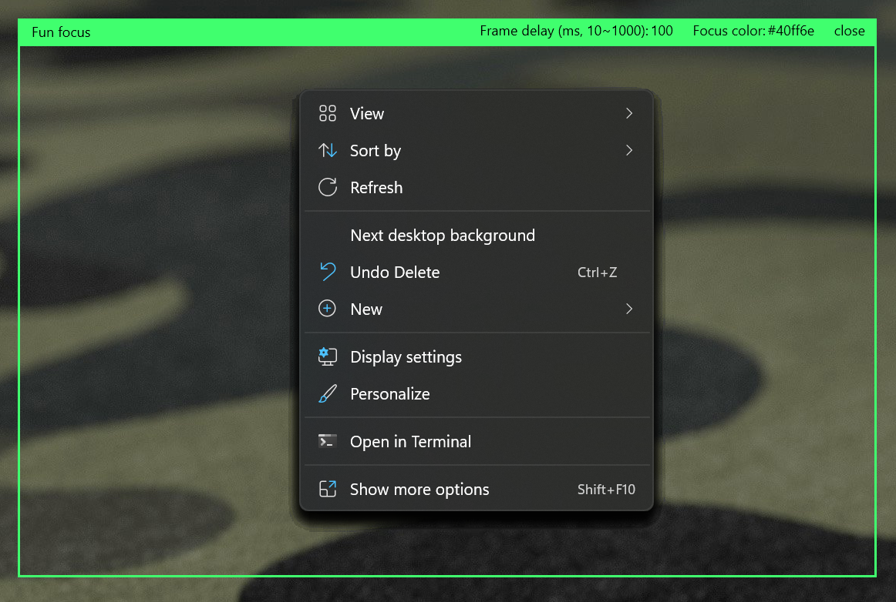

# Fun.Focus

This is a simple WPF application which you can use to share multiple windows easily with other screen sharing softwares like Microsoft Teams, Zoom etc.

Currently, those software (like Teams) does not support to share a specific area for a large screen monitor (4K etc.). You have to share the whole screen which is very unreadable for other audience. If you share window by window, when you have one or two windows, it should be ok, but **if you want to jump to a lot of different windows then it will be very hard. That is the whole purpose of this tiny application**.

## Features

- Drag and resize the window to customize the sharing area to any place with any size at any time.
- Change the title for the area to help your audience have a hint for the theme.
- Change the frame delay to balance the performance and the audience experience.
- Change the focus color. HEX color format is supported like #abff26 
- Memorize last settings.

## Tips

- You can use this application with Windows PowerToy fancy zone together, so you can easily drag any window to a specific size.
- .NET Framework 4.7.1 or above is required.

## Development

- Make sure you have dotnet sdk 6 and .NET Framework 4.7.1 SDK or above is installed.
- In the root folder, run `dotnet fsi ./build.fsx` for publish applications for different runtime.
